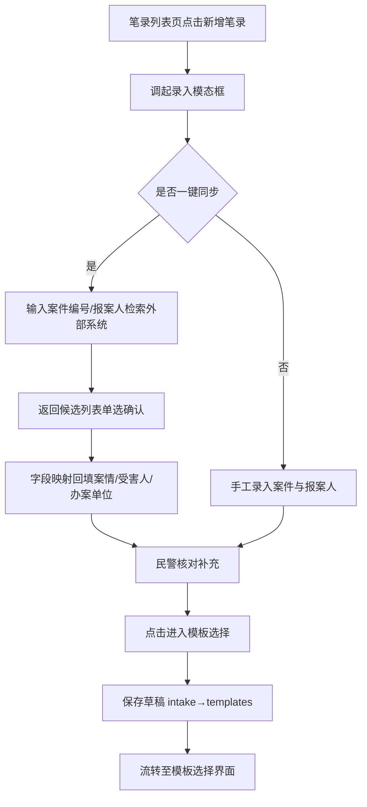
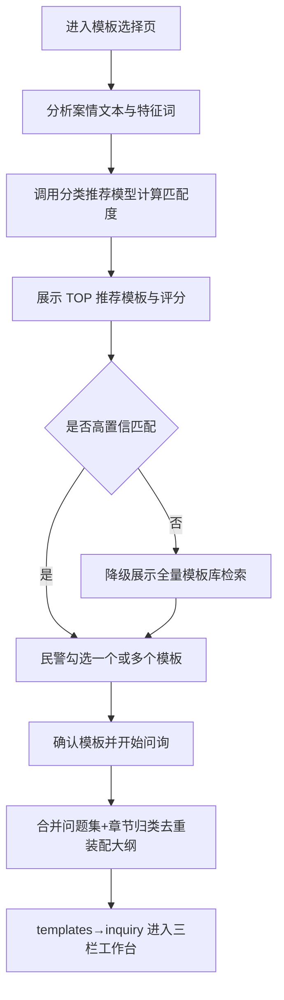
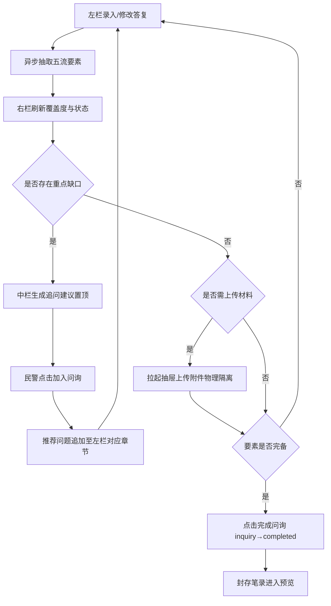
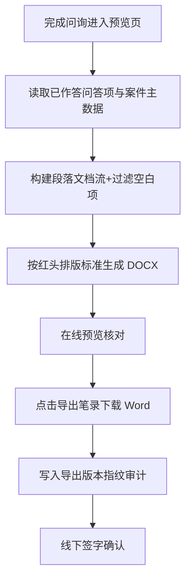
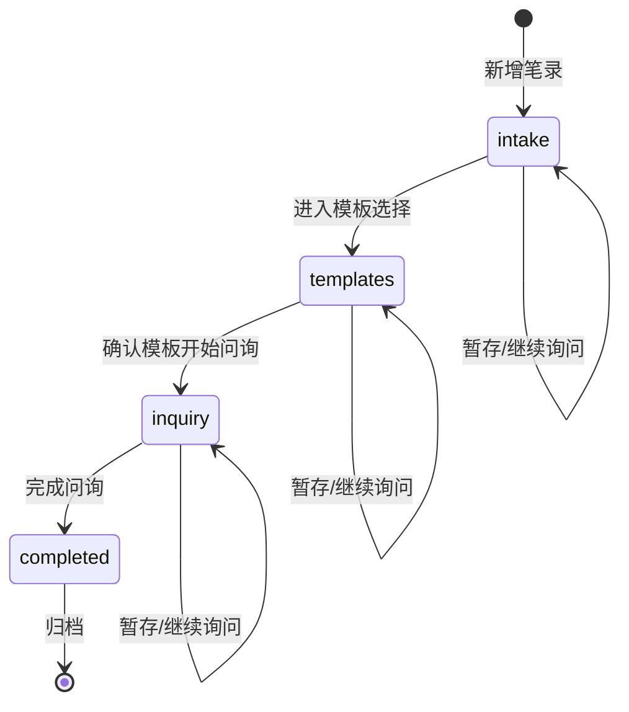
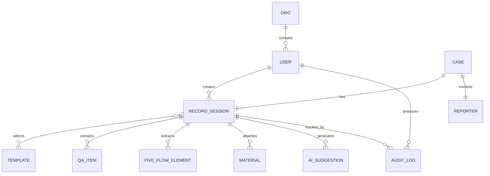
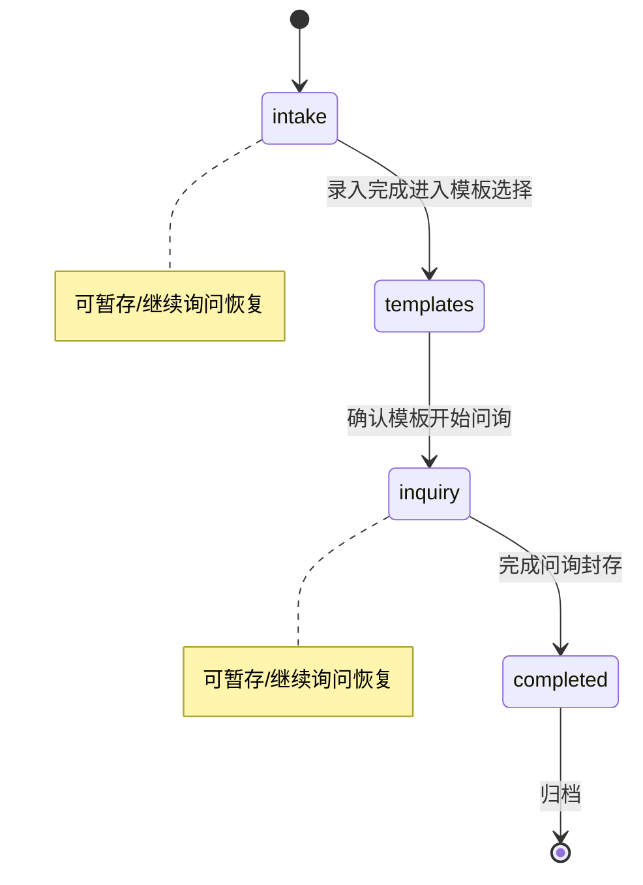

# 智能问询笔录平台 · 详细需求文档（SRS）

> **版本**：V1.0  |  **文档状态**：评审稿  |  **编制依据**：需求大纲 2.11 智能问询笔录平台

---

## 文档说明

本文档由《智能问询笔录平台需求大纲》（2.11 节）扩写而来，以大纲为唯一事实来源，遵循"只做细化、不做发明"的原则，对大纲中的每一项功能、角色、流程、规则与验收标准进行了专业化展开、颗粒度细化与合理补全。补全部分（如字段类型、校验规则、状态阈值、异常分支等）基于公安执法办案与电信网络诈骗侦查领域的通用规范与常识，未引入大纲范围之外的业务功能。

本文档适用于以下用途：

- **产品评审**：作为需求范围、角色权限与交互规格的评审基准。
- **研发实施**：前端 8 大模块、后端 8 大模块的功能落地依据。
- **测试验收**：第 11 章验收标准可直接转化为测试用例。
- **业务对接**：第 12.3 待确认问题清单用于与业务方进一步澄清。

全文关键术语与阶段英文名（intake / templates / inquiry / completed、五流、红头文书等）与大纲保持一致。所有功能需求均分配唯一编号（FR-x.y），业务流程（BP-x）、数据实体（DE-x）、页面（UI-x）、验收用例（AC-x）之间编号可相互追溯，详见第 12.2 需求追溯矩阵。

---

# 第 1 章 项目概述

## 1.1 项目背景与目标

### 1.1.1 项目背景

在公安执法办案与电信网络诈骗（以下简称"电诈"）接处警场景中，询问/讯问笔录是固定证据、查明案情的核心执法文书。传统笔录制作存在以下痛点：

- **询问要素易遗漏**：民警依赖个人经验组织问询，"五流"（人员流、通信流、网络流、资金流、寄递流）关键要素常出现缺失，导致后续侦查线索断裂、返工补询。
- **案由模板不统一**：电诈案由繁多（19 类常见案由），缺乏标准化、专业化的问询模板支撑，不同民警制作的笔录质量参差不齐。
- **文书排版耗时**：红头询问笔录需严格遵循公安文印排版标准，人工排版效率低、易出错。
- **信息孤岛**：案件信息分散在智研判、智案管等外部系统，重复录入工作量大。
- **历史笔录难复用**：以往人工记录的 Word/手写笔录无法结构化，历史要素难以回溯与二次利用。

### 1.1.2 项目目标

构建面向公安执法与反诈接处警场景的**智能问询笔录平台**，实现执法办案问询的**结构化、智能化与全要素闭环**，具体目标包括：

| 编号 | 目标 | 对应大纲 | 可衡量指标 |
|------|------|----------|-----------|
| G-1 | 案件接报录入与外部系统信息同步 | 2.11 / 2.11.1 | 支持一键检索智研判/智案管并字段回填 |
| G-2 | 涉诈案由模板智能推荐 | 2.11.4 | 19 类模板 + 通用模板，输出置信度排序 TOP 推荐 |
| G-3 | 三栏沉浸式问询工作台 | 2.11.3 | 问答编排 + AI 研判建议 + 五流缺口定位实时联动 |
| G-4 | 五流证据全要素闭环 | 2.11.4 | 实时覆盖度计算，四状态标识，重点缺口追问建议 |
| G-5 | 案件辅助材料管理与物理隔离 | 2.11.1 | 材料仅作研判输入，严禁拼接进正式问答 |
| G-6 | DOCX 标准文书生成与历史笔录导入回溯 | 2.11.3 | 红头合规排版导出，历史笔录解析重建会话 |
| G-7 | 四阶段断点续问 | 2.11.4 | intake/templates/inquiry/completed 现场精准恢复 |

## 1.2 系统定位与价值

**系统定位**：面向公安机关办案民警、反诈研判员与系统管理员的 B 端专业执法辅助平台，采用前后端分离架构，集成 AI 研判能力，覆盖"接报建档 → 模板选择 → 交互问询 → 文书导出"的端到端问询链路。

**核心价值**：

- **对办案民警**：标准化模板 + AI 辅助 + 五流缺口提醒，降低问询遗漏率，提升笔录质量与制作效率。
- **对反诈研判员**：结构化问答与五流证据图谱，便于线索复核、完整度审查与补充问询指导。
- **对执法规范化**：辅助材料物理隔离、空白项过滤、红头合规排版，保障执法程序合法性与证据链完整性。
- **对组织管理**：全量操作审计流水，支持案件访问、问答修改、文书导出等关键操作留痕追溯。

## 1.3 交付形式与范围边界

### 1.3.1 交付形式

依据大纲"交付形式"要求，本次交付包括：

1. **可运行前端控制台**：包含第 6 章定义的全部页面与交互。
2. **后端业务与分析服务**：包含第 3.7 节定义的 8 大后端模块及接口能力。
3. **19 类电信网络诈骗知识模板与脱敏演示数据**：模板库元数据、标准问题集、特征信号词及脱敏样例案件。
4. **DOCX 文书导出模块**：客户端直接生成与下载合规红头文书。
5. **端到端问询演示链路**：至少完成第 10 章一个典型业务场景的全流程演示。

### 1.3.2 范围边界

**本次范围内**：

- 用户认证登录、角色权限管理、组织机构维护、操作审计日志、Cookie 会话管理与统一拦截。
- 案件接报录入、报案人录入、草稿保存、外部系统（智研判/智案管）只读检索与字段回填。
- 19 类电诈模板 + 通用模板管理、AI 智能推荐匹配、多模板组合选定。
- 三栏问询工作台（问答编排、AI 研判建议、五流证据闭环）与辅助材料抽屉管理。
- 红头笔录在线预览、DOCX 生成下载、历史文本/文档笔录解析导入与会话重建。

**明确不在本次范围内**（Out of Scope）：

| 编号 | 不在范围项 | 说明 |
|------|-----------|------|
| OOS-1 | 外部系统数据写入 | 智研判/智案管仅提供**只读**检索与映射回填，不回写外部系统 |
| OOS-2 | 电子签名/签章 CA 集成 | DOCX 导出后线下签字确认，不含数字证书电子签 |
| OOS-3 | 视频/语音同步录音录像 | 不含询问过程音视频采集与刻录 |
| OOS-4 | 资金流向图谱可视化分析 | 五流仅做要素抽取与覆盖度统计，不含跨案件资金网络图分析 |
| OOS-5 | 移动端 App | 本期仅交付 Web 前端控制台（PC 端） |
| OOS-6 | 嫌疑人讯问专用流程 | 本期聚焦受害人/报案人**询问**笔录，不含讯问特殊程序 |

## 1.4 术语与缩略语表

| 术语/缩略语 | 英文/标识 | 定义 |
|-------------|-----------|------|
| 四阶段 | intake / templates / inquiry / completed | 笔录任务生命周期状态：接报录入 / 模板选择 / 问询进行中 / 已完成问询 |
| 五流 | Five-Flow | 人员流、通信流、网络流、资金流、寄递流五类调查要素集合 |
| 人员流 | Person Flow | 受害人身份、嫌疑人自称身份、代办人、团伙角色等要素 |
| 通信流 | Communication Flow | 涉案主叫/被叫电话、通话时长、通话时段、涉案短信等要素 |
| 网络流 | Network Flow | 引流二维码、涉案网址/域名、涉案 APP、聊天工具账号、屏幕共享记录、登录 IP 与设备标识等要素 |
| 资金流 | Fund Flow | 转账时间、金额、支付通道、转出卡号、对方开户行、对方卡号、流水号、损失总额等要素 |
| 寄递流 | Delivery Flow | 快递单号、寄件人、收件人、收发地址、涉案包裹等要素 |
| 重点缺口 | Key Gap | 核心要素（如资金流关键项）未满足时标记的最高优先级缺失状态 |
| 物理隔离 | Physical Isolation | 辅助材料仅作研判输入，严禁静默拼接进正式问答列表 |
| 红头文书 | Red-Header Document | 遵循公安文印标准排版（红色标题头）的询问笔录 DOCX |
| 三栏工作台 | Three-Column Workbench | 左栏问答编排 + 中栏 AI 研判建议 + 右栏五流证据的沉浸式问询界面 |
| 19 类案由 | 19 Fraud Categories | 冒充电商物流客服、网络婚恋交友、虚假投资理财等 19 类常见电诈案由 |
| 智研判/智案管 | External Systems | 外部业务系统，提供案件只读检索与数据映射来源 |
| 匹配度 | Match Score | 基于案情文本与模板特征信号词加权计算的推荐置信度评分 |
| SRS | Software Requirements Specification | 软件需求规格说明书 |

---

# 第 2 章 用户角色与权限模型

## 2.1 角色定义与职责

依据大纲 2.11.2，系统定义三类角色：

### 2.1.1 办案民警（Case Officer）

**职责定位**：笔录制作的主要执行者，负责从接报到导出的全流程操作。

- 创建笔录、录入案件与报案人信息、保存草稿。
- 同步外部案件信息（检索智研判/智案管并回填）。
- 选定问询模板（单选或多选组合）。
- 操作三栏工作台执行问询：行内编辑问答、新增/删除问答。
- 采纳 AI 推荐问题（一键加入问询）。
- 上传辅助证据材料（通话记录、转账流水、聊天截图等）。
- 生成并导出 DOCX 笔录。
- 导入历史笔录并回溯。

### 2.1.2 反诈研判员（Anti-Fraud Analyst）

**职责定位**：笔录质量与线索完整度的审查者，以只读研判为主。

- 查看问询笔录与解析结果。
- 审查五流证据完整度。
- 复核涉案线索与特征。
- 指导补充问询（提出补充问询意见，不直接修改正式问答正文）。

### 2.1.3 系统管理员（System Administrator）

**职责定位**：账号、组织、模板与审计的系统运维者。

- 维护警员账号、民警警号、所属组织机构（市局/分局/所队）。
- 配置问询模板库（19 类模板元数据、标准问题库、特征信号词）。
- 配置 AI 模型参数（匹配权重、置信度阈值等）。
- 查看操作审计记录。

## 2.2 权限矩阵

下表以"角色 × 功能操作"呈现权限（**操作** = 可读写执行 / **只读** = 仅查看 / **不可见** = 无入口）：

| 功能操作 | 办案民警 | 反诈研判员 | 系统管理员 |
|----------|:--------:|:----------:|:----------:|
| 登录系统 | 操作 | 操作 | 操作 |
| 查看笔录台账（本机构范围） | 操作 | 只读 | 只读 |
| 新增笔录 / 接报录入 | 操作 | 不可见 | 不可见 |
| 外部系统一键同步检索 | 操作 | 不可见 | 不可见 |
| 选定/组合问询模板 | 操作 | 不可见 | 不可见 |
| 三栏工作台执行问询（编辑问答） | 操作 | 不可见 | 不可见 |
| 采纳 AI 推荐问题 | 操作 | 不可见 | 不可见 |
| 上传辅助材料 | 操作 | 只读 | 不可见 |
| 查看五流覆盖度与解析结果 | 操作 | 只读 | 只读 |
| 生成/导出 DOCX 笔录 | 操作 | 不可见 | 不可见 |
| 导入历史笔录 | 操作 | 不可见 | 不可见 |
| 指导补充问询（批注建议） | 不可见 | 操作 | 不可见 |
| 维护警员账号/警号/机构 | 不可见 | 不可见 | 操作 |
| 配置模板库/标准问题库 | 不可见 | 只读 | 操作 |
| 配置 AI 模型参数 | 不可见 | 不可见 | 操作 |
| 查看操作审计记录 | 只读（本人） | 只读（本机构） | 操作（全量） |

> 说明：反诈研判员的"指导补充问询"以批注/建议形式记录，不直接写入正式问答正文，正式问答的修改权仅归办案民警。

## 2.3 数据权限与机构隔离规则

### 2.3.1 组织机构模型

系统采用**市局 → 分局 → 所队**三级组织架构：

| 层级 | 说明 | 数据可见范围 |
|------|------|-------------|
| 市局 | 顶级机构 | 可授权查看下辖全部分局/所队数据 |
| 分局 | 中间机构 | 可授权查看本分局及下辖所队数据 |
| 所队 | 基层机构 | 仅本所队数据 |

### 2.3.2 数据授权规则

- **DR-1（机构归属）**：每条笔录会话绑定创建民警的所属机构，机构字段不可篡改。
- **DR-2（默认隔离）**：办案民警默认仅可见本机构（所队）范围内自己参与/创建的笔录；反诈研判员可见本机构范围内全部笔录（只读）。
- **DR-3（逐级授权）**：上级机构用户经授权可向下查看所辖机构数据，遵循"最小必要"原则。
- **DR-4（越权拦截）**：任何办案操作（查看/编辑/导出）必须校验登录态 + 机构权限范围，越权请求返回 403 并记录审计。
- **DR-5（跨机构协作）**：跨机构调阅需经审批授权（本期以配置项预留，默认关闭，详见 12.3 待确认清单 Q-3）。

## 2.4 会话与登录态校验、敏感操作审计

### 2.4.1 会话管理

- **SE-1（登录态）**：采用 Cookie + Token 会话机制，登录成功签发会话凭证，前端统一拦截器校验。
- **SE-2（失效重定向）**：会话失效（超时/登出/凭证非法）时，前端统一拦截并重定向至登录页，保留当前操作上下文提示。
- **SE-3（超时策略）**：会话空闲超时自动登出（默认 30 分钟，可配置，详见 12.3 Q-4）。
- **SE-4（并发控制）**：同一笔录会话同一时刻建议单实例编辑，避免多端并发覆盖（冲突处理详见 FR-3.4）。

### 2.4.2 敏感操作审计

以下操作**全程记录审计日志**（字段见 8.4）：

| 审计触发类型 | 说明 |
|--------------|------|
| 登录/登出 | 账号、时间、IP、结果 |
| 案件访问 | 打开/查看笔录详情 |
| 外部系统同步 | 检索关键字、命中案件、回填动作 |
| 问答修改 | 新增/编辑/删除问答项（含变更前后指纹） |
| 采纳 AI 建议 | 采纳的推荐问题内容 |
| 上传材料 | 文件名、类型、大小、哈希 |
| 文书导出 | 导出时间、文书版本指纹 |
| 越权拦截 | 被拒绝的越权请求 |
| 配置变更 | 模板库/AI 参数/账号机构变更（管理员） |

审计日志不可篡改、不可删除，支持按案件编号、警员警号、操作类型、时间范围检索。

---

# 第 3 章 功能需求（核心）

> 每个功能点采用统一模板描述：**【功能编号】【功能名称】【所属模块】【角色】【前置条件】【功能描述】【输入项及校验规则】【处理逻辑】【输出/结果】【异常与边界】【关联需求】**。

## 3.1 基础能力

### FR-3.1.1 用户认证登录

| 项 | 内容 |
|----|------|
| **功能编号** | FR-3.1.1 |
| **功能名称** | 用户认证登录 |
| **所属模块** | 后端·认证与权限模块 / 前端·认证与会话模块 |
| **角色** | 全部角色 |
| **前置条件** | 管理员已维护警员账号、警号、所属机构 |
| **功能描述** | 用户输入账号密码登录，系统校验身份、签发 Cookie/Token 会话凭证，并根据角色与机构加载对应功能菜单与数据范围 |
| **输入项及校验规则** | 账号（警号，必填，格式校验）；密码（必填，长度≥8，密文传输）；验证码（可选，连续失败 3 次后启用） |
| **处理逻辑** | 1) 校验账号存在且状态正常；2) 校验密码（加盐哈希比对）；3) 加载角色与机构权限；4) 签发会话凭证；5) 写入登录审计 |
| **输出/结果** | 登录成功跳转笔录管理大盘，返回用户身份、角色、机构与权限清单 |
| **异常与边界** | 账号不存在/密码错误（统一提示"账号或密码错误"，防枚举）；账号停用；连续失败锁定（默认 5 次锁定 15 分钟）；会话并发限制 |
| **关联需求** | FR-3.1.2、FR-3.1.5、SE-1~SE-4、AC-1 |

### FR-3.1.2 角色权限管理

| 项 | 内容 |
|----|------|
| **功能编号** | FR-3.1.2 |
| **功能名称** | 角色权限管理 |
| **所属模块** | 后端·认证与权限模块 |
| **角色** | 系统管理员 |
| **前置条件** | 管理员已登录 |
| **功能描述** | 维护角色（办案民警/反诈研判员/系统管理员）与功能权限的绑定关系，控制菜单、按钮与接口的可见/可操作性 |
| **输入项及校验规则** | 角色标识、权限项清单（菜单/操作/接口）；权限项不可为空 |
| **处理逻辑** | 基于 RBAC 模型，前端按权限渲染菜单与按钮，后端接口二次校验权限，双重防护 |
| **输出/结果** | 权限矩阵生效，用户登录后仅呈现授权范围内的功能 |
| **异常与边界** | 权限变更实时生效（下次请求校验）；禁止删除内置三类角色；越权调用返回 403 |
| **关联需求** | 2.2 权限矩阵、FR-3.1.5、AC-1 |

### FR-3.1.3 组织机构维护

| 项 | 内容 |
|----|------|
| **功能编号** | FR-3.1.3 |
| **功能名称** | 组织机构维护 |
| **所属模块** | 后端·认证与权限模块 |
| **角色** | 系统管理员 |
| **前置条件** | 管理员已登录 |
| **功能描述** | 维护市局/分局/所队三级组织架构，管理警员账号、警号与机构归属关系 |
| **输入项及校验规则** | 机构名称、机构编码（唯一）、上级机构、层级；警员：姓名、警号（唯一）、所属机构、角色、状态 |
| **处理逻辑** | 树形机构增删改查；警号唯一性校验；机构删除前校验是否存在下辖机构或在职警员 |
| **输出/结果** | 组织机构树与警员归属关系持久化，作为数据权限隔离基础 |
| **异常与边界** | 机构编码/警号重复拒绝；存在下级或在职警员的机构不可删除（提示先迁移）；停用警员不可登录 |
| **关联需求** | DR-1~DR-5、FR-3.1.2 |

### FR-3.1.4 操作审计日志

| 项 | 内容 |
|----|------|
| **功能编号** | FR-3.1.4 |
| **功能名称** | 操作审计日志 |
| **所属模块** | 后端·审计监控模块 |
| **角色** | 系统管理员（全量）/ 办案民警（本人）/ 反诈研判员（本机构） |
| **前置条件** | 用户已登录 |
| **功能描述** | 记录案件访问、问答修改、文书导出等关键操作的审计流水，支持检索与追溯 |
| **输入项及校验规则** | 系统自动采集：案件编号、警员警号、操作类型、操作时间戳、变更指纹、IP；检索条件：案件编号/警号/操作类型/时间范围 |
| **处理逻辑** | 关键操作切面拦截 → 异步写入审计存储 → 生成变更指纹（前后值哈希） |
| **输出/结果** | 审计流水列表，支持分页与条件检索、明细查看 |
| **异常与边界** | 审计写入失败不阻断主流程但需告警重试；日志只增不删不改；保留期限可配置（默认≥3 年） |
| **关联需求** | 2.4.2、8.4、AC-1 |

### FR-3.1.5 Cookie 会话管理与统一拦截

| 项 | 内容 |
|----|------|
| **功能编号** | FR-3.1.5 |
| **功能名称** | Cookie 会话管理与统一拦截 |
| **所属模块** | 前端·认证与会话模块 / 后端·认证与权限模块 |
| **角色** | 全部角色 |
| **前置条件** | 用户已登录 |
| **功能描述** | 前端统一拦截器在每次请求携带并校验会话凭证，后端校验登录态与机构权限，失效时统一重定向 |
| **输入项及校验规则** | 请求头/Cookie 中的会话凭证；凭证有效性、时效性、机构权限范围 |
| **处理逻辑** | 前端拦截器统一附加凭证 → 后端过滤器校验 → 通过则放行，失败返回 401/403 → 前端捕获并重定向登录页 |
| **输出/结果** | 合法请求正常处理，非法请求被拦截并记录 |
| **异常与边界** | 凭证过期/篡改 → 401 重定向；越权 → 403 记录审计；网络异常友好提示 |
| **关联需求** | SE-1~SE-4、FR-3.1.2、DR-4 |

## 3.2 接报与建档

### FR-3.2.1 案件/报案人信息录入与草稿保存

| 项 | 内容 |
|----|------|
| **功能编号** | FR-3.2.1 |
| **功能名称** | 案件接报录入与草稿保存 |
| **所属模块** | 前端·接报录入模块 / 后端·笔录生命周期模块 |
| **角色** | 办案民警 |
| **前置条件** | 民警已登录，具备本机构建档权限 |
| **功能描述** | 通过"新增笔录"调起录入模态框，录入案件基本信息与报案人信息，支持草稿保存并流转至模板选择 |
| **输入项及校验规则** | 案件编号（必填，唯一，格式校验）；案件类别（必填，下拉，19 类案由 + 其他）；简要案情（必填，长文本，≥10 字）；办案单位（必填，默认当前机构）；报案人姓名（必填）；报案人证件号（选填，格式校验）；报案人联系电话（选填，手机号校验）；接报时间（默认当前，可调整） |
| **处理逻辑** | 1) 前端字段必填与格式校验；2) 保存草稿 → 阶段标记为 intake；3) 点击"进入模板选择" → 校验必填完整 → 保存并流转 templates |
| **输出/结果** | 生成笔录会话（阶段=intake/templates），案件与报案人主数据持久化 |
| **异常与边界** | 案件编号重复拒绝；必填缺失阻止流转并高亮；草稿可随时暂存退出，下次"继续询问"恢复 intake 现场 |
| **关联需求** | FR-3.2.2、FR-4.5、6.2、AC-3 |

### FR-3.2.2 外部系统一键同步与字段回填

| 项 | 内容 |
|----|------|
| **功能编号** | FR-3.2.2 |
| **功能名称** | 外部系统案件一键同步与字段回填 |
| **所属模块** | 前端·接报录入模块 / 后端·外部系统集成模块 |
| **角色** | 办案民警 |
| **前置条件** | 已打开接报录入模态框，外部系统（智研判/智案管）可用 |
| **功能描述** | 通过"一键同步其他系统信息"折叠面板，输入案件编号或报案人检索外部系统，单选命中案件后自动回填案情、受害人、办案单位至表单 |
| **输入项及校验规则** | 检索关键字（案件编号/报案人，必填其一）；外部系统来源选择（智研判/智案管） |
| **处理逻辑** | 1) 调用外部系统只读检索接口；2) 返回候选列表；3) 用户单选确认；4) 字段映射（外部字段 → 本地字段）回填；5) 记录同步审计 |
| **输出/结果** | 表单字段自动填充，民警可核对修改后保存 |
| **异常与边界** | 无命中（提示未检索到）；多条命中需单选；外部系统超时/不可用（降级为手工录入并提示）；字段映射缺失项留空待补；**严禁回写外部系统**（OOS-1） |
| **关联需求** | FR-4.1、6.2、2.4.2 审计、AC-3 |

## 3.3 模板体系与推荐

### FR-3.3.1 19 类电诈模板库与通用模板管理

| 项 | 内容 |
|----|------|
| **功能编号** | FR-3.3.1 |
| **功能名称** | 19 类电诈模板库与通用模板管理 |
| **所属模块** | 后端·模板配置服务 |
| **角色** | 系统管理员（维护）/ 办案民警（使用） |
| **前置条件** | 管理员已登录 |
| **功能描述** | 维护 19 类电诈专业模板与通用询问模板的元数据、专属问题集与特征信号词，支持动态加载 |
| **输入项及校验规则** | 模板名称、案由类别、大纲章节结构、标准问题集、特征信号词列表、启用状态 |
| **处理逻辑** | 模板元数据 CRUD；问题集与信号词维护；启用/停用控制；变更实时生效供推荐与问询调用 |
| **输出/结果** | 结构化模板库，供 AI 推荐与大纲装配使用 |
| **异常与边界** | 停用模板不出现在推荐结果；删除模板需校验是否被进行中会话引用（引用中不可删，仅可停用） |
| **关联需求** | FR-3.3.2、FR-3.3.3、12.1、AC-4 |

### FR-3.3.2 AI 智能推荐匹配

| 项 | 内容 |
|----|------|
| **功能编号** | FR-3.3.2 |
| **功能名称** | 基于案情文本的 AI 智能推荐匹配 |
| **所属模块** | 后端·AI 研判推荐模块 / 前端·模板推荐模块 |
| **角色** | 办案民警 |
| **前置条件** | 已完成接报录入（阶段=templates），案情文本可用 |
| **功能描述** | 分析案情文本与特征词，调用分类推荐模型，输出置信度排序的 TOP 推荐模板及匹配度评分 |
| **输入项及校验规则** | 案情文本（简要案情 + 案件类别）；推荐数量（默认 TOP 3~5） |
| **处理逻辑** | 见下方【匹配度加权算法】 |
| **输出/结果** | 推荐模板卡片列表（含匹配度百分比、命中信号词、展开/收起的推荐理由），支持全量模板库检索兜底 |
| **异常与边界** | 案情文本过短（<10 字）提示补充；无高置信匹配时降级展示全量模板库；模型超时返回全量库并提示 |
| **关联需求** | FR-3.3.3、FR-4.2、6.3、AC-4 |

**【匹配度加权算法说明】**

设某模板 \(T\) 对案情文本 \(D\) 的匹配度评分 \(S(D,T)\)：

\[ S(D,T) = \alpha \cdot F_{sig}(D,T) + \beta \cdot F_{cat}(D,T) + \gamma \cdot F_{sem}(D,T) \]

其中：

| 因子 | 含义 | 计算方式 |
|------|------|---------|
| \(F_{sig}\) 信号词命中因子 | 案情中命中模板特征信号词的比例与权重 | \(\sum (w_i \cdot hit_i) / \sum w_i\)，\(w_i\) 为第 i 个信号词权重，\(hit_i \in \{0,1\}\) |
| \(F_{cat}\) 案由类别因子 | 录入案件类别与模板案由是否一致 | 一致取 1.0，同类近似取 0.6，不一致取 0 |
| \(F_{sem}\) 语义相似因子 | 案情文本与模板描述的语义相似度 | 分类模型输出的相似度得分（0~1） |
| \(\alpha,\beta,\gamma\) 权重系数 | 各因子权重，由管理员在 AI 参数中配置 | 默认 \(\alpha=0.4, \beta=0.2, \gamma=0.4\)，且 \(\alpha+\beta+\gamma=1\) |

最终按 \(S(D,T)\) 降序排列，取 TOP N（默认 5）作为推荐结果；仅当 \(S \geq\) 置信度阈值（默认 0.6，可配置）时标记为"高置信度推荐"。

### FR-3.3.3 多模板组合选定

| 项 | 内容 |
|----|------|
| **功能编号** | FR-3.3.3 |
| **功能名称** | 多模板组合选定与大纲装配 |
| **所属模块** | 前端·模板推荐模块 / 后端·笔录生命周期模块 |
| **角色** | 办案民警 |
| **前置条件** | 已展示推荐模板与全量模板库 |
| **功能描述** | 民警勾选一个或多个适用涉诈案由模板，确认后系统合并装配问询大纲章节与预设问题集，进入三栏工作台 |
| **输入项及校验规则** | 选中模板集合（≥1 个） |
| **处理逻辑** | 1) 多选模板问题集合并；2) 按标准大纲章节（固定开头、接触引流、被骗经过、资金损失、证据补充）归类去重；3) 装配问询大纲 → 阶段流转 inquiry |
| **输出/结果** | 生成含分章节预设问题集的问询大纲，进入三栏工作台 |
| **异常与边界** | 未选模板阻止开始问询；多模板问题重复时去重保留首次；章节冲突按标准章节顺序归并 |
| **关联需求** | FR-3.3.1、FR-4.2、6.3、AC-4 |

## 3.4 三栏沉浸式问询工作台

### 3.4.1 左栏·问答编排区

#### FR-3.4.1 结构化大纲章节问答编排

| 项 | 内容 |
|----|------|
| **功能编号** | FR-3.4.1 |
| **功能名称** | 结构化大纲章节问答编排 |
| **所属模块** | 前端·三栏工作台核心模块 / 后端·笔录生命周期模块 |
| **角色** | 办案民警 |
| **前置条件** | 已选定模板并装配大纲（阶段=inquiry） |
| **功能描述** | 按大纲章节（固定开头、接触引流、被骗经过、资金损失、证据补充）组织卡片流，支持问题行内实时编辑、答案录入、新增/删除问答与来源标记 |
| **输入项及校验规则** | 问题文本（必填）；答案文本（可空，空为未作答）；所属章节（枚举）；来源标识（模板预置/AI 推荐/手动新增） |
| **处理逻辑** | 1) 问答双向绑定实时保存；2) 行内富文本编辑；3) 新增问答插入指定章节；4) 删除需二次确认；5) 每次变更异步触发五流要素抽取与审计 |
| **输出/结果** | 结构化问答列表（含章节归类、来源标识、作答状态），实时同步至中/右栏 |
| **异常与边界** | 删除模板预置问题需确认；答案未录入时导出过滤；并发编辑冲突提示（SE-4）；富文本非法内容过滤 |
| **关联需求** | FR-3.4.2、FR-3.4.3、FR-5.2、6.4、AC-5 |

### 3.4.2 中栏·AI 侦查研判建议区

#### FR-3.4.2 AI 特征提取与侦查研判建议

| 项 | 内容 |
|----|------|
| **功能编号** | FR-3.4.2 |
| **功能名称** | AI 侦查研判建议与推荐问题 |
| **所属模块** | 后端·AI 研判推荐模块 / 前端·三栏工作台核心模块 |
| **角色** | 办案民警（采纳）/ 反诈研判员（只读） |
| **前置条件** | 问询进行中，已有部分问答上下文 |
| **功能描述** | AI 自动提取事实特征、输出涉诈类型判定与依据、生成下一步侦查建议、推荐补充问题并支持一键添加入笔录 |
| **输入项及校验规则** | 当前问答上下文、案情文本；无需手动输入，自动触发 |
| **处理逻辑** | 1) 问答变更后异步调用研判模型；2) 提取事实特征；3) 生成案由类型判定 + 判定依据支撑链；4) 生成侦查指引与推荐补充问题；5) 若存在重点缺口，追问建议置顶 |
| **输出/结果** | 中栏展示：涉诈类型判定、判断依据、侦查指引建议、推荐补充问题卡片及"加入问询"按钮 |
| **异常与边界** | 上下文不足时提示继续录入；模型超时展示上次结果并标注；采纳后推荐问题转为左栏问答项（来源=AI 推荐），去重处理 |
| **关联需求** | FR-3.4.1、FR-5.4、FR-3.7.5、6.4、AC-7 |

### 3.4.3 右栏·五流证据闭环区

#### FR-3.4.3 五流覆盖度实时计算与缺口定位

| 项 | 内容 |
|----|------|
| **功能编号** | FR-3.4.3 |
| **功能名称** | 五流覆盖度实时计算与缺口定位 |
| **所属模块** | 后端·五流要素分析引擎 / 前端·三栏工作台核心模块 |
| **角色** | 办案民警（操作）/ 反诈研判员（只读） |
| **前置条件** | 问询进行中，已录入部分答复 |
| **功能描述** | 实时计算五流（人员/通信/网络/资金/寄递）覆盖度，标识"已收集/需补充/重点缺口/不涉及"四种状态，定位缺失证据要素，展示提取证据摘要片段 |
| **输入项及校验规则** | 问答答复文本（自动抽取，无需手入） |
| **处理逻辑** | 1) 录入答复异步抽取要素（实体识别 + 关系抽取）；2) 按流归集要素；3) 计算覆盖度（已收集要素数/应收集要素总数）；4) 判定状态（见 FR-5.3）；5) 定位缺口要素 |
| **输出/结果** | 右栏五个流卡片，呈现覆盖进度条、状态标签、已提取证据摘要与缺口清单 |
| **异常与边界** | 抽取失败不阻断问询（降级为手动补充）；核心要素（如资金流）未满足自动标重点缺口并联动中栏追问 |
| **关联需求** | FR-5.1~FR-5.4、FR-3.4.2、6.4、AC-6 |

### 3.4.4 辅助材料抽屉

#### FR-3.4.4 辅助材料拖拽上传与物理隔离

| 项 | 内容 |
|----|------|
| **功能编号** | FR-3.4.4 |
| **功能名称** | 辅助材料拖拽上传与物理隔离 |
| **所属模块** | 前端·材料管理模块 / 后端·文件与存储模块 |
| **角色** | 办案民警（上传）/ 反诈研判员（只读） |
| **前置条件** | 问询进行中 |
| **功能描述** | 右侧滑出抽屉，提供材料拖拽上传与列表管理（通话记录、转账流水、聊天截图等），**明确物理隔离于问答正文** |
| **输入项及校验规则** | 文件（拖拽/点击上传）；类型白名单（图片/PDF/文档等，可配）；大小限制（默认≤50MB/个，可配）；病毒扫描通过 |
| **处理逻辑** | 1) 上传文件→病毒扫描→文件校验（哈希）→存储；2) 生成材料列表元数据；3) 材料**仅作研判算法输入**，不写入问答正文；4) 访问授权控制 |
| **输出/结果** | 材料抽屉列表（文件名、类型、大小、上传人、时间），供研判与导出引用 |
| **异常与边界** | 病毒/非法文件拒绝；超限提示；**严禁静默拼接插入正式笔录问答列表**（保障执法程序合法性） |
| **关联需求** | FR-5.5、FR-3.7.7、6.4、AC-8 |

## 3.5 案件材料与文书

### FR-3.5.1 红头笔录在线实时预览

| 项 | 内容 |
|----|------|
| **功能编号** | FR-3.5.1 |
| **功能名称** | 红头笔录在线实时预览 |
| **所属模块** | 前端·DOCX 导出引擎 / 后端·笔录生命周期模块 |
| **角色** | 办案民警 |
| **前置条件** | 问询已完成或进行中预览 |
| **功能描述** | 展示标准红头格式询问笔录全文（红头标题、案件信息、问答正文、落款信息），实时反映最新问答内容 |
| **输入项及校验规则** | 笔录会话 ID；已作答问答项与案件主数据 |
| **处理逻辑** | 读取会话已作答问答项→按公安询问笔录排版规范构建预览文档流→过滤未作答空白项 |
| **输出/结果** | 在线预览页面，呈现红头文书效果 |
| **异常与边界** | 无已作答内容提示；预览与导出排版一致 |
| **关联需求** | FR-3.5.2、8.1、6.5 |

### FR-3.5.2 DOCX 标准文书生成与下载

| 项 | 内容 |
|----|------|
| **功能编号** | FR-3.5.2 |
| **功能名称** | DOCX 标准文书排版生成与下载 |
| **所属模块** | 前端·DOCX 导出引擎 |
| **角色** | 办案民警 |
| **前置条件** | 笔录已预览确认 |
| **功能描述** | 基于前端文档流生成标准排版，客户端直接生成与下载合规 DOCX 文书 |
| **输入项及校验规则** | 笔录会话数据；导出选项（是否含五流覆盖表/研判报告） |
| **处理逻辑** | 1) 读取已作答问答与案件主数据；2) 按红头排版标准（宋体、加粗"问："标记、标准行距）构建文档流；3) 过滤未作答空白项；4) 客户端生成 DOCX 下载 |
| **输出/结果** | 符合公安文印标准的 DOCX 笔录文件 |
| **异常与边界** | 生成失败提示重试；文书版本指纹写入审计；导出后线下签字确认（OOS-2） |
| **关联需求** | FR-3.5.1、FR-5.5、8.1、6.5、AC-10 |

### FR-3.5.3 历史文本/文档笔录解析导入

| 项 | 内容 |
|----|------|
| **功能编号** | FR-3.5.3 |
| **功能名称** | 历史笔录解析导入与会话重建 |
| **所属模块** | 前端·笔录导入模块 / 后端·五流要素分析引擎 |
| **角色** | 办案民警 |
| **前置条件** | 民警已登录 |
| **功能描述** | 支持上传已有笔录文件或粘贴文本，自动解析提取问答对，归类大纲章节，生成五流证据分析报告并转存为新问询会话 |
| **输入项及校验规则** | 笔录文件（Word/文本）或粘贴文本；格式校验 |
| **处理逻辑** | 1) 解析文档提取问答对；2) 大纲结构还原与章节归类；3) 五流要素抽取生成证据图谱；4) 识别缺失流→转化为继续问询草稿；5) 重建新会话 |
| **输出/结果** | 新笔录会话（含解析问答、五流分析报告、缺口追问草稿） |
| **异常与边界** | 解析失败提示手工校对；非标准格式降级为纯文本导入；历史笔录不覆盖现有会话 |
| **关联需求** | FR-4.5、6.6、AC-9、场景 10.2 |

## 3.6 前端模块要求（八大模块职责细化）

| 模块编号 | 模块名称 | 核心职责 | 关联功能 | 关联页面 |
|---------|---------|---------|---------|---------|
| FE-1 | 认证与会话模块 | 用户登录校验、Cookie 会话保持、权限拦截与失效重定向 | FR-3.1.1、FR-3.1.5 | 登录页 |
| FE-2 | 笔录台账模块 | 大盘渲染、复合多条件检索、状态筛选、摘要气泡浮层与分页导航 | FR-3.1.4 | 6.1 |
| FE-3 | 接报录入模块 | 接报表单渲染、字段必填校验、外部系统案件检索与数据映射回填 | FR-3.2.1、FR-3.2.2 | 6.2 |
| FE-4 | 模板推荐模块 | AI 推荐算法结果展示、卡片折叠展开、多模板选择器与状态联动 | FR-3.3.2、FR-3.3.3 | 6.3 |
| FE-5 | 三栏工作台核心模块 | 问答双向绑定、行内富文本编辑、AI 建议流联动、五流图表实时更新 | FR-3.4.1~FR-3.4.3 | 6.4 |
| FE-6 | 材料管理模块 | 辅助材料拖拽上传、文件列表管理与材料隔离边界控制 | FR-3.4.4 | 6.4 抽屉 |
| FE-7 | DOCX 导出引擎 | 基于前端文档流生成标准排版，客户端直接生成与下载合规文书 | FR-3.5.1、FR-3.5.2 | 6.5 |
| FE-8 | 笔录导入模块 | 历史笔录文本解析、大纲结构还原与会话重建 | FR-3.5.3 | 6.6 |

## 3.7 后端模块要求（八大模块职责与接口能力）

| 模块编号 | 模块名称 | 核心职责 | 主要接口能力 | 关联功能 |
|---------|---------|---------|-------------|---------|
| BE-1 | 认证与权限模块 | 警员身份校验、Token/Cookie 签发、组织机构数据权限控制 | 登录/登出、会话校验、权限查询、机构树 | FR-3.1.1~FR-3.1.5 |
| BE-2 | 笔录生命周期模块 | 笔录会话新增、断点阶段保存、状态流转、详情查询与归档 | 会话 CRUD、阶段保存/恢复、状态流转、归档 | FR-3.2.1、FR-4.5 |
| BE-3 | 外部系统集成模块 | 对接智研判、智案管等外部系统，提供只读案件检索与数据映射 | 案件检索（只读）、字段映射回填 | FR-3.2.2 |
| BE-4 | 模板配置服务 | 19 类电诈模板元数据管理、标准问题库维护与动态加载 | 模板 CRUD、问题库维护、动态加载 | FR-3.3.1 |
| BE-5 | AI 研判推荐模块 | 基于案情与问答上下文匹配模板、生成侦查研判建议与追问问题 | 模板推荐、研判建议、推荐问题生成 | FR-3.3.2、FR-3.4.2 |
| BE-6 | 五流要素分析引擎 | 对问答记录执行实体识别与关系抽取，输出五流覆盖统计与缺口清单 | 要素抽取、覆盖度计算、缺口清单、解析导入 | FR-3.4.3、FR-3.5.3 |
| BE-7 | 文件与存储模块 | 案件辅助材料上传保存、病毒扫描、文件校验与访问授权 | 文件上传、病毒扫描、校验、授权下载 | FR-3.4.4 |
| BE-8 | 审计监控模块 | 记录案件访问、问答修改、文书导出等关键操作的审计流水 | 审计写入、审计检索、变更指纹 | FR-3.1.4 |

---

# 第 4 章 业务流程（端到端）

## 4.1 接报建档与外部案件同步流程（BP-1）

**步骤：**

1. 民警在笔录列表页点击"新增笔录"，调起录入模态框。
2. 点击"一键同步其他系统信息"展开折叠面板，输入案件编号或报案人检索外部系统（智研判/智案管）。
3. 系统返回候选列表，民警选中匹配案件并确认。
4. 系统自动将外部案情、受害人、办案单位回填至表单。
5. 民警核对/补充字段，点击"进入模板选择"。
6. 系统保存接报草稿（阶段 intake → templates）并流转至模板选择界面。

## 4.2 AI 智能推荐与多模板选定流程（BP-2）

**步骤：**

1. 系统分析案情文本与特征词，调用分类推荐模型（FR-3.3.2）。
2. 界面展示 TOP 推荐模板及匹配度评分，并提供全量模板库检索。
3. 民警勾选一个或多个适用的涉诈案由模板。
4. 点击"确认模板并开始问询"，系统装配问询大纲章节与预设问题集（FR-3.3.3），阶段 templates → inquiry，进入三栏工作台。

## 4.3 三栏交互式问询与五流闭环流程（BP-3）

**步骤：**

1. 民警依据左栏大纲向受害人发问，行内录入或修改答复内容。
2. 系统根据录入答复实时提取要素，动态刷新右栏"五流"覆盖度统计。
3. 识别到关键要素缺失时，系统在中栏生成追问建议与推荐问题（重点缺口置顶）。
4. 民警核实后点击"加入问询"，推荐问题自动追加至左栏对应章节。
5. 涉及转账凭证等材料时，民警拉起材料抽屉上传附件，附件内容物理隔离于正式问答。
6. 要素采集完备后，民警点击"完成问询"，系统封存笔录数据（inquiry → completed）并进入预览界面。

## 4.4 文书生成与导出流转流程（BP-4）

**步骤：**

1. 系统读取笔录会话已作答的问答项列表与案件主数据。
2. 依据公安机关询问笔录排版规范构建段落文档流，过滤未作答空白项。
3. 排版生成符合文印标准样式的 DOCX 文书。
4. 民警核对在线预览效果后，点击"导出笔录"下载 Word 文档供签字确认。

## 4.5 四阶段断点续问机制（BP-5）

每个笔录任务持久化保存当前阶段标识：intake（接报录入）、templates（模板选择）、inquiry（问询进行中）、completed（已完成问询）。点击"继续询问"时，系统识别阶段并精准恢复工作界面，保留已录入表单、选定模板、问答内容与附件状态。

**阶段识别与现场恢复逻辑：**

| 当前阶段 | 恢复目标界面 | 恢复内容 |
|---------|-------------|---------|
| intake | 接报录入模态框 | 已录入的案件/报案人表单字段、同步回填内容 |
| templates | 模板智能匹配页 | 已展示的推荐结果、已勾选模板 |
| inquiry | 三栏工作台 | 已录入问答、选定模板、五流覆盖状态、已上传附件、AI 建议 |
| completed | 笔录预览页 | 已封存笔录全文与导出入口 |

---

# 第 5 章 五流研判体系与规则

## 5.1 五流各要素明细表

### 5.1.1 人员流（Person Flow）

| 要素编号 | 要素名称 | 字段类型 | 说明 |
|---------|---------|---------|------|
| P-01 | 受害人身份 | 文本/证件号 | 受害人姓名、身份证件等身份信息 |
| P-02 | 嫌疑人自称身份 | 文本 | 嫌疑人冒充的身份（如客服、公检法人员） |
| P-03 | 代办人 | 文本 | 代为操作的人员信息 |
| P-04 | 团伙角色 | 文本 | 诈骗团伙内部分工角色 |

### 5.1.2 通信流（Communication Flow）

| 要素编号 | 要素名称 | 字段类型 | 说明 |
|---------|---------|---------|------|
| C-01 | 涉案主叫电话 | 电话号码 | 拨打给受害人的号码 |
| C-02 | 涉案被叫电话 | 电话号码 | 受害人回拨/被叫号码 |
| C-03 | 通话时长 | 时长 | 单次/累计通话时长 |
| C-04 | 通话时段 | 时间区间 | 通话发生的时间段 |
| C-05 | 涉案短信 | 文本 | 涉案短信内容 |

### 5.1.3 网络流（Network Flow）

| 要素编号 | 要素名称 | 字段类型 | 说明 |
|---------|---------|---------|------|
| N-01 | 引流二维码 | 图片/链接 | 引流使用的二维码 |
| N-02 | 涉案网址/域名 | URL | 涉案网站网址或域名 |
| N-03 | 涉案 APP | 文本 | 涉案应用名称（如国盛智投） |
| N-04 | 聊天工具账号 | 文本 | 涉案聊天工具及账号 |
| N-05 | 屏幕共享记录 | 文本/图片 | 远程屏幕共享情况 |
| N-06 | 登录 IP 与设备标识 | 文本 | 涉案登录 IP、设备号 |

### 5.1.4 资金流（Fund Flow）

| 要素编号 | 要素名称 | 字段类型 | 说明 |
|---------|---------|---------|------|
| F-01 | 转账时间 | 时间 | 每笔转账的时间 |
| F-02 | 转账金额 | 金额 | 每笔转账金额 |
| F-03 | 支付通道 | 文本 | 银行/第三方支付/虚拟币等 |
| F-04 | 转出卡号 | 卡号 | 受害人转出银行卡号 |
| F-05 | 对方开户行 | 文本 | 收款方开户银行 |
| F-06 | 对方卡号 | 卡号 | 收款方银行卡号 |
| F-07 | 流水号 | 文本 | 转账交易流水号 |
| F-08 | 损失总额 | 金额 | 累计损失金额 |

### 5.1.5 寄递流（Delivery Flow）

| 要素编号 | 要素名称 | 字段类型 | 说明 |
|---------|---------|---------|------|
| D-01 | 快递单号 | 文本 | 涉案快递单号 |
| D-02 | 寄件人 | 文本 | 寄件人信息 |
| D-03 | 收件人 | 文本 | 收件人信息 |
| D-04 | 收发地址 | 文本 | 寄件/收件地址 |
| D-05 | 涉案包裹 | 文本 | 包裹内容描述 |

## 5.2 要素抽取规则

- **ER-1（抽取时机）**：录入答复时**异步**抽取要素，不阻断前台问询交互。
- **ER-2（抽取方式）**：五流要素分析引擎对问答记录执行实体识别（NER）与关系抽取，将抽取结果映射至 5.1 各要素字段。
- **ER-3（增量更新）**：每次问答变更后仅重新抽取变更项，归集至对应流，实时刷新覆盖度。
- **ER-4（抽取降级）**：抽取失败或置信度低时，不自动填充，标记为待手动确认，不阻断问询。
- **ER-5（证据摘要）**：抽取结果生成证据摘要片段（如转账时间、对方卡号、流水号）展示于右栏。

## 5.3 覆盖度计算与状态判定规则

**覆盖度公式：**

\[ Cov(Flow) = \frac{N_{collected}}{N_{required}} \times 100\% \]

其中 \(N_{collected}\) 为该流已抽取到的要素数，\(N_{required}\) 为该流应收集要素总数（根据案由动态确定，不涉及项不计入分母）。

**四状态判定规则：**

| 状态 | 触发条件 | 说明 |
|------|---------|------|
| 已收集 | \(Cov = 100\%\) | 该流全部应收要素均已采集 |
| 需补充 | \(0 < Cov < 100\%\) 且非核心要素缺失 | 部分要素缺失，需补充 |
| 重点缺口 | 核心要素（如资金流 F-04/F-06/F-02）未满足 | 最高优先级缺失，中栏置顶生成追问 |
| 不涉及 | 该流与当前案由无关（\(N_{required}=0\)） | 不计入覆盖度分母 |

> 核心要素清单可配，默认资金流（F-01、F-02、F-04、F-06、F-08）为核心要素；具体阀值参见 12.3 Q-5。

## 5.4 重点缺口追问建议生成规则

- **GR-1（触发）**：当某流被判定为"重点缺口"时，自动触发追问建议生成。
- **GR-2（置顶）**：重点缺口追问建议在中栏**置顶**展示，优先于普通建议。
- **GR-3（内容）**：追问建议针对缺失的具体核心要素生成，例："请明确每笔转账的时间、转出银行卡号及对方收款卡号和户名"。
- **GR-4（一键采纳）**：民警点击"加入问询"，推荐问题自动追加至左栏对应章节（来源=AI 推荐），并去重。
- **GR-5（动态更新）**：缺口补齐后，追问建议自动移除，状态更新为已收集/需补充。

## 5.5 证据材料隔离与文书合规导出规则

- **IR-1（物理隔离）**：辅助材料仅作为研判算法输入，**严禁静默拼接插入正式笔录问答列表**，确保执法程序合法性。
- **IR-2（空白过滤）**：导出 DOCX 时自动过滤未作答空白条目，仅输出已作答问答对。
- **IR-3（红头排版）**：严格遵循公安红头文书排版标准（宋体、加粗"问："标记、正体"答："、标准行距）。
- **IR-4（版本指纹）**：导出文书生成版本指纹并写入审计，保障证据链完整性。
- **IR-5（材料引用）**：辅助材料可在五流覆盖表/研判报告中引用，但不混入问答正文。

---

# 第 6 章 页面与交互规格

## 6.1 笔录管理与统计大盘（UI-1）

**布局与区域：**

| 区域 | 内容 | 控件/交互 |
|------|------|----------|
| 顶部统计区 | 笔录统计计数（总数/各状态数） | 数字卡片展示 |
| 检索区 | 搜索输入框、状态下拉筛选器 | 关键字检索（案件编号/案情/报案人）；状态筛选（未问询/问询中/已问询） |
| 入口区 | "新增笔录"与"导入笔录"入口 | 按钮，调起对应模态框/页面 |
| 数据表格区 | 案件编号、案件类别、简要案情、报案人、办案民警、问询状态胶囊 | 简要案情鼠标悬浮气泡详情卡片；分页控件 |
| 操作列 | "继续询问"（自适应恢复断点阶段）、"查看解析结果" | 按钮，根据阶段跳转对应界面 |

**交互行为：**

- 检索/筛选实时刷新表格，支持多条件复合。
- 简要案情过长时截断，悬浮展示完整气泡详情卡。
- "继续询问"根据持久化阶段标识自适应恢复（见 BP-5）。
- 分页导航支持页码跳转与每页条数切换。

## 6.2 案件接报与同步模态框（UI-2）

**布局与区域：**

| 区域 | 内容 | 控件/交互 |
|------|------|----------|
| 表单区 | 案件编号、简要案情、办案单位、报案人信息 | 输入框/下拉/长文本，必填校验 |
| 同步面板 | "一键同步其他系统信息"折叠面板 | 可展开，输入关键字检索外部系统 |
| 检索结果区 | 外部系统候选案件列表 | 单选确认回填 |
| 底部操作区 | "保存草稿"、"进入模板选择"、"取消" | 按钮 |

**交互行为：**

- 同步面板默认收起，展开后输入关键字检索，命中列表单选后自动回填对应字段。
- 字段必填校验不通过时高亮提示并阻止流转。
- 回填后字段仍可手动修改核对。

## 6.3 问询模板智能匹配页（UI-3）

**布局与区域：**

| 区域 | 内容 | 控件/交互 |
|------|------|----------|
| 左侧 | 原案基础信息摘要卡片 | 展示案件编号、类别、简要案情、报案人 |
| 右上 | AI 智能推荐模板卡片 | 匹配度评分、展开/收起切换、命中信号词 |
| 右下 | 全量模板库检索与多选 | 搜索框、模板列表、多选框 |
| 底部 | "确认模板并开始问询" | 按钮，未选时禁用 |

**交互行为：**

- 推荐卡片按匹配度降序，可展开查看推荐理由与命中信号词。
- 推荐区与全量库均可多选，选中状态联动（已选模板高亮）。
- 确认后装配大纲并进入三栏工作台。

## 6.4 三栏沉浸式问询工作台（UI-4）

**布局与区域：**

| 区域 | 内容 | 控件/交互 |
|------|------|----------|
| 顶部状态栏 | 案件编号、问询进度条、计时统计 | "暂时保存"、"完成问询"、"导出笔录"按钮 |
| 左栏（正式问答区） | 按大纲章节（固定开头、接触引流、被骗经过、资金损失、证据补充）组织卡片流 | 问题行内编辑、答案录入、新增/删除问答、来源标记 |
| 中栏（AI 侦查研判区） | 涉诈类型判定、判断依据、侦查指引建议、推荐补充问题卡片 | "加入问询"按钮 |
| 右栏（五流证据区） | 人员流、通信流、网络流、资金流、寄递流五个卡片 | 实时覆盖进度、状态标签（已收集/需补充/重点缺口/不涉及）、证据摘要 |
| 材料抽屉 | 右侧滑出抽屉 | 材料拖拽上传与列表，物理隔离于问答正文 |

**交互行为：**

- 左栏问答双向绑定，录入后实时保存并异步触发中/右栏刷新。
- 中栏"加入问询"将推荐问题追加至左栏对应章节。
- 右栏五流卡片实时呈现覆盖度与状态，重点缺口高亮。
- 材料抽屉可拉起/收起，上传附件不影响问答正文。
- "暂时保存"保留当前阶段现场；"完成问询"封存并进入预览。

## 6.5 笔录文书预览与导出页（UI-5）

**布局与区域：**

| 区域 | 内容 | 控件/交互 |
|------|------|----------|
| 预览区 | 标准红头格式询问笔录全文 | 红头标题、案件信息、问答正文、落款信息 |
| 操作区 | DOCX 导出、返回工作台 | 按钮 |

**交互行为：**预览区实时渲染红头文书效果；点击导出下载 DOCX；返回工作台可继续编辑（completed 前）。

## 6.6 历史笔录导入与回溯页（UI-6）

**布局与区域：**

| 区域 | 内容 | 控件/交互 |
|------|------|----------|
| 上传区 | 上传已有笔录文件或粘贴文本 | 文件上传/文本域 |
| 解析结果区 | 提取的问答对与大纲章节归类 | 展示解析问答、五流证据分析报告 |
| 操作区 | 转存为新问询会话 | 按钮，支持针对缺口开展二次补充问询 |

**交互行为：**上传/粘贴后自动解析提取问答对，生成五流证据图谱，识别缺失流并转化为继续问询草稿，转存为新会话。

---

# 第 7 章 数据模型（概要设计）

## 7.1 核心实体清单

| 实体编号 | 实体名称 | 说明 |
|---------|---------|------|
| DE-1 | 笔录会话（RecordSession） | 核心实体，贯穿四阶段生命周期 |
| DE-2 | 案件（Case） | 案件基本信息 |
| DE-3 | 报案人（Reporter） | 报案人/受害人信息 |
| DE-4 | 模板（Template） | 19 类电诈模板与通用模板 |
| DE-5 | 问答项（QAItem） | 单个问答对，含章节与来源 |
| DE-6 | 五流要素（FiveFlowElement） | 抽取的五流要素与状态 |
| DE-7 | 辅助材料（Material） | 上传的附件材料 |
| DE-8 | 审计日志（AuditLog） | 操作审计流水 |
| DE-9 | 用户/机构（User/Org） | 警员账号与组织机构 |
| DE-10 | AI 研判建议（AiSuggestion） | 中栏研判与推荐问题 |

## 7.2 关键实体字段表

### 7.2.1 笔录会话（DE-1）

| 字段名 | 类型 | 说明 | 约束 |
|--------|------|------|------|
| session_id | string | 会话主键 | PK, 唯一 |
| case_id | string | 关联案件 | FK→DE-2 |
| stage | enum | 阶段标识 | intake/templates/inquiry/completed |
| creator_org | string | 创建机构 | 不可篡改 |
| creator_no | string | 创建民警警号 | FK→DE-9 |
| selected_templates | array | 已选模板 | FK→DE-4 |
| progress | number | 问询进度 | 0~100 |
| created_at / updated_at | datetime | 创建/更新时间 | 非空 |

### 7.2.2 问答项（DE-5）

| 字段名 | 类型 | 说明 | 约束 |
|--------|------|------|------|
| qa_id | string | 问答主键 | PK |
| session_id | string | 所属会话 | FK→DE-1 |
| chapter | enum | 大纲章节 | 固定开头/接触引流/被骗经过/资金损失/证据补充 |
| question | text | 问题内容 | 非空 |
| answer | text | 答案内容 | 可空（空=未作答） |
| source | enum | 来源标识 | 模板预置/AI 推荐/手动新增 |
| sort_order | number | 排序 | 非空 |

### 7.2.3 五流要素（DE-6）

| 字段名 | 类型 | 说明 | 约束 |
|--------|------|------|------|
| element_id | string | 要素主键 | PK |
| session_id | string | 所属会话 | FK→DE-1 |
| flow_type | enum | 流类型 | 人员/通信/网络/资金/寄递 |
| element_code | string | 要素编号 | 如 F-04 |
| value | text | 抽取值 | 可空 |
| status | enum | 状态 | 已收集/需补充/重点缺口/不涉及 |
| evidence_snippet | text | 证据摘要片段 | 可空 |

## 7.3 实体关系图

## 7.4 笔录会话状态机（四阶段流转图）

---

# 第 8 章 输出物与文书格式规范

## 8.1 标准询问笔录文书（DOCX）排版规格

| 区域 | 排版要求 |
|------|---------|
| 红头标题 | 红色文印标题（如"XX公安局询问笔录"），居中，红色字体 |
| 案件基本信息 | 时间、地点、询问人、被询问人，宋体，标准信息栏排版 |
| 问答正文 | 分章节问答对；"问："加粗（黑体），"答："正体（宋体）；标准行距 |
| 落款信息 | 被询问人核对签名区、办案人员署名区，预留签字位置 |
| 字体规范 | 正文宋体，标题黑体；未作答空白项自动过滤 |

## 8.2 五流证据要素覆盖表格式

| 流类型 | 收集状态 | 已提取证据摘要 | 重点缺口清单 |
|--------|---------|---------------|-------------|
| 人员流 | 已收集/需补充/重点缺口/不涉及 | 如受害人身份、嫌疑人自称身份 | 列出缺失要素 |
| 通信流 | 同上 | 如涉案主叫电话、通话时段 | 同上 |
| 网络流 | 同上 | 如涉案 APP、引流网址 | 同上 |
| 资金流 | 同上 | 如转账时间、对方卡号、流水号 | 同上 |
| 寄递流 | 同上 | 如快递单号、收发地址 | 同上 |

## 8.3 AI 侦查研判指引报告格式

| 部分 | 内容 |
|------|------|
| 案由判定结论 | 涉诈类型判定（如虚假投资理财类） |
| 判定依据支撑链 | 支撑判定的事实特征与命中信号词 |
| 嫌疑人画像推断 | 基于要素推断的嫌疑人特征 |
| 下游资金链拦截建议 | 资金流相关的拦截与止付建议 |
| 后续补充侦查指引 | 针对缺口与线索的补充侦查建议 |

## 8.4 操作审计流水记录字段

| 字段名 | 类型 | 说明 |
|--------|------|------|
| case_no | string | 案件编号 |
| officer_no | string | 警员警号 |
| op_type | enum | 操作类型（创建/修改/采纳建议/上传材料/导出文书） |
| op_time | datetime | 操作时间戳 |
| change_fingerprint | string | 变更指纹（前后值哈希） |
| ip | string | 操作来源 IP |

---

# 第 9 章 非功能需求

## 9.1 性能

| 编号 | 需求项 | 指标 |
|------|--------|------|
| NFR-P1 | 页面首屏渲染时间 | ≤ 2s（常规网络） |
| NFR-P2 | 问答录入实时保存响应 | ≤ 500ms |
| NFR-P3 | 五流要素异步抽取延迟 | 不阻断前台，后台≤ 3s 刷新 |
| NFR-P4 | AI 推荐/研判响应 | ≤ 5s，超时降级展示 |
| NFR-P5 | 并发支持 | 支持≥ 200 并发在线问询（可横向扩展，详见 12.3 Q-6） |
| NFR-P6 | DOCX 客户端生成 | ≤ 3s（常规篇幅） |

## 9.2 安全与合规

| 编号 | 需求项 | 说明 |
|------|--------|------|
| NFR-S1 | 执法程序合法性 | 辅助材料物理隔离，严禁拼接进正式问答 |
| NFR-S2 | 数据脱敏 | 演示数据均脱敏；敏感字段展示/存储脱敏 |
| NFR-S3 | 权限隔离 | 基于组织架构的数据授权与访问控制 |
| NFR-S4 | 传输安全 | 密码密文传输，会话凭证防篡改 |
| NFR-S5 | 审计留痕 | 关键操作全程记录，日志只增不删不改 |
| NFR-S6 | 文件安全 | 上传文件病毒扫描与校验 |

## 9.3 可用性/易用性、可维护性、可扩展性、兼容性

| 编号 | 类别 | 需求 |
|------|------|------|
| NFR-U1 | 易用性 | 三栏工作台沉浸式布局，关键操作一键完成 |
| NFR-U2 | 可用性 | 系统可用性≥ 99.5%（详见 12.3 Q-6） |
| NFR-U3 | 可维护性 | 前后端分离，模块职责清晰（八大前端/八大后端模块） |
| NFR-U4 | 可扩展性 | 模板库、AI 参数、五流要素可配置扩展 |
| NFR-U5 | 兼容性 | 主流浏览器（Chrome/Edge）PC 端，DOCX 兼容 Word |

## 9.4 数据合规与证据链完整性

| 编号 | 需求项 | 说明 |
|------|--------|------|
| NFR-C1 | 证据链完整性 | 文书版本指纹、审计留痕保障可追溯 |
| NFR-C2 | 数据保留 | 笔录与审计数据保留期限可配（默认≥3 年） |
| NFR-C3 | 不可篡改 | 审计日志、已封存笔录不可静默修改 |
| NFR-C4 | 合规导出 | 导出文书过滤空白项，遵循红头排版标准 |

---

# 第 10 章 示例业务场景（端到端演示）

## 10.1 虚假投资理财类电诈接报与资金流缺口追问闭环

**场景背景**：受害人报案称被诱导下载"国盛智投"APP 炒股亏损 80 万元。

**端到端步骤：**

| 步骤 | 环节 | 输入 | 系统输出 |
|------|------|------|---------|
| 1 | 接报录入 | 民警录入案情：被诱导下载"国盛智投"APP 炒股亏损 80 万 | 保存草稿，阶段 intake |
| 2 | AI 推荐 | 案情文本 | 高置信度推荐"虚假投资理财类"模板（匹配度高） |
| 3 | 模板选定 | 勾选模板 | 装配大纲，阶段 inquiry，进入三栏工作台 |
| 4 | 问询录入 | 逐项录入被骗经过 | 右栏实时抽取五流要素 |
| 5 | 缺口识别 | 受害人仅回答损失总金额，对方收款户名与卡号未录入 | 资金流标记为"重点缺口" |
| 6 | 追问建议 | 系统自动 | 中栏置顶生成："请明确每笔转账的时间、转出银行卡号及对方收款卡号和户名" |
| 7 | 一键采纳 | 民警点击加入问询 | 追问问题追加至左栏资金损失章节 |
| 8 | 线索查明 | 受害人补充 | 查明 3 笔向涉诈一级卡转账的关键线索 |
| 9 | 材料上传 | 民警拉起抽屉 | 上传手机银行转账截图（物理隔离） |
| 10 | 导出文书 | 点击完成问询→导出 | 生成符合公安规范的 DOCX 红头笔录供受害人签字 |

## 10.2 历史手写/文本笔录文档解析导入与要素回溯

**场景背景**：民警将以往人工记录的 Word 格式电诈笔录导入系统。

**端到端步骤：**

| 步骤 | 环节 | 输入 | 系统输出 |
|------|------|------|---------|
| 1 | 导入文件 | 上传 Word 格式历史笔录 | 解析引擎自动提取问答对 |
| 2 | 章节归类 | 解析问答 | 归类大纲章节，还原结构 |
| 3 | 五流图谱 | 问答内容 | 生成五流证据图谱 |
| 4 | 缺口识别 | 系统分析 | 识别出历史笔录缺少通信流（嫌疑人手机号）与网络流（涉案引流网址） |
| 5 | 转草稿 | 系统自动 | 将缺失要素转化为继续问询草稿 |
| 6 | 二次补询 | 民警开展 | 支持针对性开展二次补充问询 |

> **演示说明**：本期至少任选一个场景完成端到端全流程演示（建议优先 10.1，覆盖五流重点缺口闭环与 DOCX 导出完整链路）。

---

# 第 11 章 验收标准

将大纲 2.11.10 的每一条转化为可测试验收用例：

| 验收编号 | 验收项 | 验收方法/步骤 | 预期结果 | 对应功能需求 |
|---------|--------|-------------|---------|-------------|
| AC-1 | 登录与权限展示 | 使用账号密码登录，分别以三类角色登录 | 正常登录，根据民警身份及机构展示对应功能与数据 | FR-3.1.1、FR-3.1.2、FR-3.1.5 |
| AC-2 | 笔录列表与检索 | 打开笔录列表，关键字检索、状态筛选、悬浮摘要、分页 | 查看全部笔录，检索/筛选/悬浮/分页均正常 | FR-3.1.4、UI-1 |
| AC-3 | 接报录入与外部回填 | 新增笔录录入案件/报案人，一键同步检索外部系统并回填 | 录入成功，外部案件信息一键回填至表单 | FR-3.2.1、FR-3.2.2 |
| AC-4 | AI 推荐与多选模板 | 录入案情后观察推荐，多选模板并合并生成大纲 | 生成置信度排序 AI 推荐，支持多选合并生成问询大纲 | FR-3.3.2、FR-3.3.3 |
| AC-5 | 三栏问答编辑 | 在工作台编辑、追加、删除问答 | 正常编辑/追加/删除，章节大纲清晰归类 | FR-3.4.1 |
| AC-6 | 五流覆盖实时更新 | 录入答复后观察右栏五流状态 | 实时更新五流覆盖状态，正确标示已收集/需补充/重点缺口 | FR-3.4.3、FR-5.3 |
| AC-7 | 中栏研判与一键采纳 | 观察中栏建议，点击加入问询 | 获取研判建议，一键采纳推荐问题并追加至问答流 | FR-3.4.2、FR-5.4 |
| AC-8 | 材料上传与隔离 | 上传辅助材料，检查问答正文 | 上传成功且与正式问答内容物理隔离 | FR-3.4.4、FR-5.5 |
| AC-9 | 四阶段断点恢复 | 分别在各阶段退出后点击"继续询问" | 精准恢复 intake/templates/inquiry/completed 四个断点现场 | FR-4.5、BP-5 |
| AC-10 | DOCX 合规导出 | 完成问询后导出笔录 | 生成格式合规 DOCX 并成功下载，含规范红头、案由信息与"问/答"正文排版 | FR-3.5.2、FR-8.1 |
| AC-11 | 历史笔录导入回溯 | 导入历史笔录文件，观察解析结果 | 解析提取问答、生成五流分析、识别缺口转草稿 | FR-3.5.3、UI-6 |
| AC-12 | 端到端场景演示 | 按 10.1 或 10.2 完整走一遍全流程 | 至少一个典型场景完成端到端全流程问询演示 | 第 10 章 |

---

# 第 12 章 附录

## 12.1 19 类电信网络诈骗案由清单

> 大纲明确列举了其中 6 类（冒充电商物流客服、网络婚恋交友、虚假投资理财、虚假征信、刷单返利、冒充公检法），其余依据反诈领域通用案由补全，待业务方确认（详见 Q-1）。

| 序号 | 案由名称 | 典型特征信号词 |
|------|---------|---------------|
| 1 | 冒充电商物流客服 | 退款、理赔、客服、快递丢失、刷单理赔 |
| 2 | 网络婚恋交友 | 交友、婚恋、情感、投资、聊天软件 |
| 3 | 虚假投资理财 | 投资、理财、炒股、APP、高回报、亏损 |
| 4 | 虚假征信 | 征信、注销校园贷、信用修复、央行征信 |
| 5 | 刷单返利 | 刷单、返利、佣金、任务、兼职 |
| 6 | 冒充公检法 | 公检法、通缉令、涉嫌洗钱、安全账户 |
| 7 | 冒充领导熟人 | 领导、熟人、换号、急用钱 |
| 8 | 冒充客服退款 | 退款、取消会员、误操作理赔 |
| 9 | 虚假购物服务 | 低价、代购、预付、不发货 |
| 10 | 虚假贷款 | 贷款、无抵押、刷流水、解冻金 |
| 11 | 代办信用卡 | 代办、信用卡、提额、手续费 |
| 12 | 游戏产品交易 | 游戏账号、装备、代练、私下交易 |
| 13 | 网络游戏虚假交易 | 充值、返利、客服锁单 |
| 14 | 中奖抽奖 | 中奖、领奖、税金、手续费 |
| 15 | 红包返利 | 红包、返利、群、充值返 |
| 16 | 冒充军警购物 | 军警、采购、物资、供应商 |
| 17 | 虚假网络招嫖 | 招嫖、服务、定金、刷单 |
| 18 | 医保社保诈骗 | 医保、社保、异常、涉嫌骗保 |
| 19 | 其他新型网络诈骗 | 屏幕共享、远程控制、虚拟币、新手法 |

> 通用询问模板作为兜底，适用于无法归入上述 19 类或跨类组合情形。

## 12.2 需求追溯矩阵（大纲条目 → 文档章节）

| 大纲条目 | 内容 | 对应文档章节 |
|---------|------|-------------|
| 2.11 项目目标/交付形式 | 项目目标与交付 | 1.1、1.3 |
| 2.11.1 开发范围 | 基础能力/接报建档/模板/三栏/文书 | 3.1、3.2、3.3、3.4、3.5 |
| 2.11.2 用户角色与权限 | 三类角色与权限隔离 | 2.1、2.2、2.3、2.4 |
| 2.11.3 页面需求 | 各页面布局与交互 | 6.1~6.6 |
| 2.11.4 问询流转与五流体系 | 四阶段/19 类/五流规则 | 4.5、5.1~5.5、3.3 |
| 2.11.5 前端模块要求 | 八大前端模块 | 3.6 |
| 2.11.6 后端模块要求 | 八大后端模块 | 3.7 |
| 2.11.7 核心业务流程 | 四大流程 | 4.1~4.4 |
| 2.11.8 文书与研判输出格式 | 四种输出格式 | 8.1~8.4 |
| 2.11.9 示例业务场景 | 两个场景 | 10.1、10.2 |
| 2.11.10 验收标准 | 11 条验收 | 11（AC-1~AC-12） |

## 12.3 待确认问题清单

| 编号 | 待确认问题 | 影响范围 | 建议 |
|------|-----------|---------|------|
| Q-1 | 19 类案由完整清单需业务方确认（大纲仅明列 6 类） | 12.1、3.3.1 | 与反诈业务方核对完整 19 类名称与信号词 |
| Q-2 | 智研判/智案管接口协议与字段映射表 | 3.2.2、BE-3 | 获取外部系统接口文档与字段字典 |
| Q-3 | 跨机构调阅审批流程是否本期实现 | 2.3.2 DR-5 | 确认是否预留或延后 |
| Q-4 | 会话超时时长与锁定策略具体值 | 2.4.1、FR-3.1.1 | 确认安全策略基线 |
| Q-5 | 各流核心要素清单与重点缺口阀值 | 5.3 | 确认核心要素与阈值配置 |
| Q-6 | 并发量与可用性 SLA 目标 | 9.1、9.3 | 确认部署规模与 SLA |
| Q-7 | AI 模型选型（本地/云端）与部署方式 | 3.3.2、3.4.2、BE-5 | 确认模型部署与合规要求 |
| Q-8 | DOCX 红头模板具体样式（各地公安差异） | 8.1、FR-3.5.2 | 获取标准红头文书模板样例 |

---

> 本文档由需求大纲扩写而成，若大纲与本文存在歧义，以大纲为准；补全细节（字段、阈值、异常分支等）需经业务方确认后回写本文。
